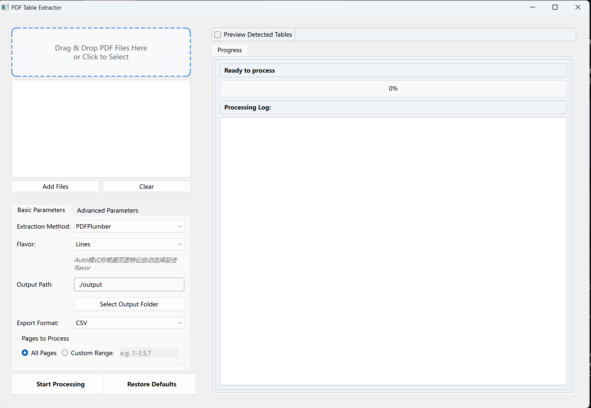

# PDF Table Extractor

[](https://opensource.org/licenses/MIT)
[](https://www.python.org/downloads/)
[](https://pypi.org/project/PySide6/)
[](https://pdfdataextractor.streamlit.app)

一个智能的PDF表格提取工具，支持基于文本的PDF和基于图像的PDF表格自动识别与提取。

## 🌐 在线体验

**无需安装，直接在浏览器中使用：**

[](https://pdfdataextractor.streamlit.app)

> ⚠️ **测试版本限制**：在线版本仅支持测试小文件（最大 10 MB），建议使用小型PDF文件进行测试。

## 🚀 主要功能

- **双引擎表格提取**：智能选择最适合的提取方法
  - 文本PDF：使用pdfplumber或camelot进行高精度提取
  - 扫描PDF：使用Transformer+EasyOCR进行图像表格识别
- **智能方法选择**：根据PDF特征自动选择最优提取策略
- **自动参数计算**：基于页面特征自动计算最优参数
- **多种使用方式**：
  - 🖥️ **桌面GUI**：直观的GUI界面，支持批量处理
  - 🌐 **在线Web**：Streamlit Web应用，无需安装即可使用
- **多格式导出**：
  - 桌面GUI：支持CSV、JSON格式导出
  - 在线Web：支持CSV、Excel格式导出

## 📸 功能演示



*PDF Table Extractor 主界面*

## 🔧 核心特性

### 1. 智能方法选择

系统会根据PDF的特征自动选择最适合的提取方法：

```
PDF页面 → 检测文本量 → 
├─ 文本量<50字符 → 扫描PDF → Transformer+EasyOCR
└─ 文本量≥50字符 → 文本PDF → 
    ├─ 提取页面特征（线条、文本、字符）
    ├─ 预判表格类型（有框/无框）
    └─ 选择方法：
        ├─ 有框表格 → Camelot lattice 或 PDFPlumber lines
        └─ 无框表格 → Camelot stream 或 PDFPlumber text
```

### 2. 文本PDF表格提取

对于基于文本的PDF，系统会：

1. **页面特征分析**：提取线条、文本、字符等基础信息
2. **表格类型预判**：判断是否存在有框表格
3. **参数自动计算**：根据页面特征计算最优参数
4. **方法选择**：
   - 有框表格：使用Camelot lattice或PDFPlumber lines模式
   - 无框表格：使用Camelot stream或PDFPlumber text模式

**技术文档**：
- [Camelot库的表格提取机制](https://github.com/livezingy/PDFDataExtractor/blob/main/docs/camelot_table_extraction_guide.md)
- [pdfplumber库的表格提取机制](https://github.com/livezingy/PDFDataExtractor/blob/main/docs/pdfplumber_table_extraction_guide.md)
- [Camelot/PDFPlumber参数计算原理](https://github.com/livezingy/PDFDataExtractor/blob/main/docs/parameter_calculation_formulas.md)

### 3. 扫描PDF表格提取

对于基于图像的PDF，系统使用Transformer+EasyOCR进行表格识别：


*单元格检测可视化*


*特殊标签识别*


*表格结构识别*

**处理流程**：
1. **Detection模型**：检测表格区域
2. **Structure模型**：识别单元格结构
3. **EasyOCR**：提取文本内容
4. **文本匹配**：将OCR文本与单元格匹配
5. **跨行/跨列处理**：处理合并单元格
6. **生成DataFrame**：输出结构化数据

**技术文档**：
- [Transformer表格处理逻辑](https://github.com/livezingy/PDFDataExtractor/blob/main/docs/transformer_table_processing.md)
- [结构识别结果分析](https://github.com/livezingy/PDFDataExtractor/blob/main/docs/recognize_structure_analysis.md)

## 🛠️ 技术架构

### 核心组件

- **PageProcessor**：页面处理器，负责方法选择和流程控制
- **TableProcessor**：表格处理器，实现具体的提取逻辑
- **PageFeatureAnalyzer**：页面特征分析器，计算最优参数
- **TableEvaluator**：表格质量评估器，评估提取结果
- **TableParser**：表格解析器，处理Transformer识别结果

### 依赖库

- **GUI框架**：PySide6
- **PDF处理**：pdfplumber, camelot-py, PyMuPDF
- **深度学习**：torch, transformers
- **OCR引擎**：EasyOCR, pytesseract
- **图像处理**：opencv-python, Pillow
- **数据处理**：pandas, numpy, scipy

## 📋 系统要求

- Python 3.8+
- Windows 10/11 (推荐)
- 8GB+ RAM (推荐)
- 2GB+ 可用磁盘空间

## 📥 模型文件下载

本项目需要以下模型文件，请手动下载并放置：

### 模型文件下载地址
- **模型文件下载**：[点击下载模型文件](https://pan.quark.cn/s/af664c3b4a96)

### 安装说明
1. 下载模型文件压缩包
2. 解压到项目根目录（与main.py同路径）
3. 确保目录结构如下：

```
PDFDataExtractor/
├── main.py
├── models/
│   ├── table-transformer/
│   │   ├── detection/
│   │   └── structure/
│   ├── EasyOCR/
│   │   └── model/
│   └── Tesseract-OCR/
│       └── tesseract.exe
├── core/
├── gui/
└── ...
```

### 模型文件说明
- **table-transformer/**: Transformer模型文件（检测和结构识别）
- **EasyOCR/model/**: EasyOCR本地模型文件
- **Tesseract-OCR/**: Tesseract OCR引擎文件

## 🚧 当前局限性

### 1. 参数计算优化
Camelot和PDFPlumber的参数自动计算算法仍有改进空间，特别是在处理复杂表格布局时的参数调优。

### 2. OCR识别精度
EasyOCR在识别表格中的文本时，识别精度有待进一步提升。

### 3. 后续工作
- 优化参数计算算法，提高复杂表格的提取准确率
- 集成更多OCR引擎，提升文本识别精度
- 增加表格质量评估和自动纠错功能
- 支持更多输出格式和自定义配置

## 📄 许可证

本项目采用 [MIT License](LICENSE) 许可证。

## 🤝 贡献

欢迎提交Issue和Pull Request来帮助改进这个项目。

---

*PDF Table Extractor - 让表格提取更智能、更准确*
